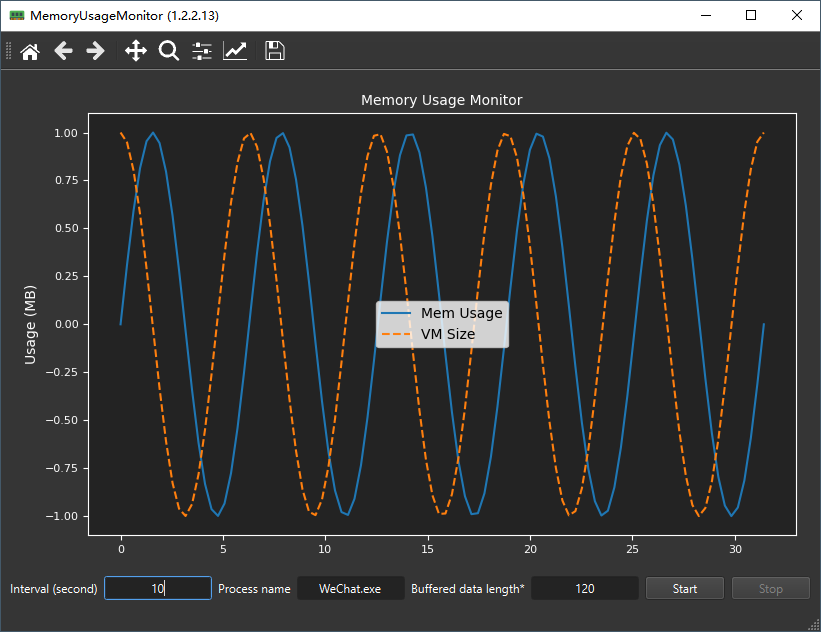
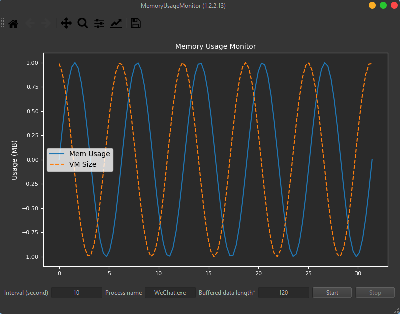

# Memory monitor

Simple memory usage monitor program based on psutil and Qt.
An interval adjustable timer is used to poll memory usage of process
with dedicated name and then display the latest changeable sampled points
on the main windows, sampled points are also recorded in log.

Matplotlib is used to display the chart. Python logging module is used to
record sampled points.

## Shortcuts
- Ctrl+T: toggle Windows OnTop (this function is deactivated if qtmodern module is used).
- Ctrl+S: toggle Start/Stop of monitoring.
- Ctrl+O: load a memory log and then draw usage curves of selected processes.  

## Screenshots

